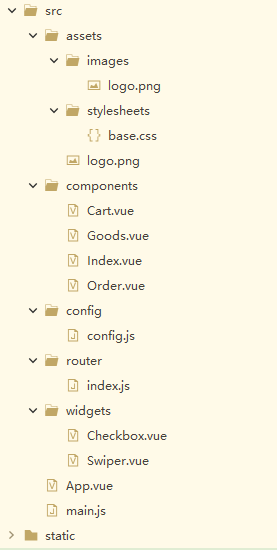

# 打造线上商城
## 一.项目构建
### 1.1 目录结构

- assets/stylesheets 用于存放独立的样式表. 个人推荐将组件的样式表放在组件模板中书写,而stylesheets中的样式表则在main.js中引入,以达到全局共享的目的.
- components目录用于存放Vue的单文件模板. 目录下的Index.vue,Goods.Vue
### 1.2 webpack是什么?
### 1.3 Font Awesome图标库
## 二.动态资源和数据
### 2.1 关于配置
### 2.2 动态资源
### 2.3 动态数据的存储
## 三.自定义组件
### 3.1 幻灯片
### 3.1 复选框